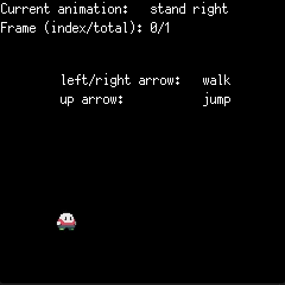

# Ebitenconsole

Simple console I use for my [ebiten](https://hajimehoshi.github.io/ebiten/) game/demos to set variables runtime.

---

## Usage

```go
func main() {
    ...
    ebitenconsole.FloatVar(&gravity, "g", "world gravity")
    ...
}
```

then to capture input, and draw console on screen, do:

```go
func update(screen *ebiten.Image) {
    ...
    ebitenconsole.CheckInput()        // Records key presses
    console := ebitenconsole.String() // String that represents the console, with > and blinking _ (see below)
    ebitenutil.DebugPrintAt(screen, console, 0, 220)
    ...
}
```

## Result



### Ideas

- [ ] Separate input and parsing logic, result could be sent to chat or something else, rather than my parser
- [ ] remove 'set', allow \<variable\>=\<value>
- [ ] allow user to bind function to commands `restart` --> `func() error {}`
